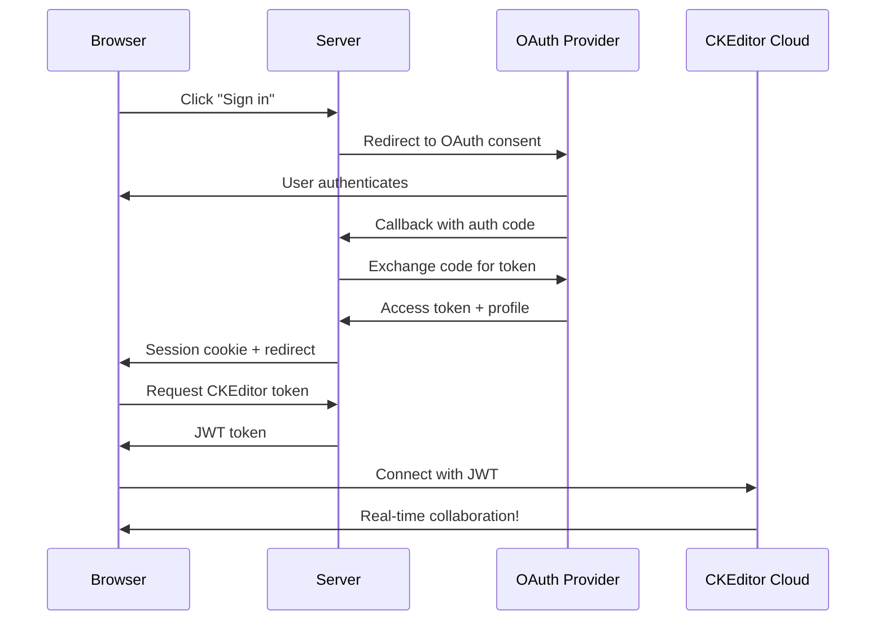
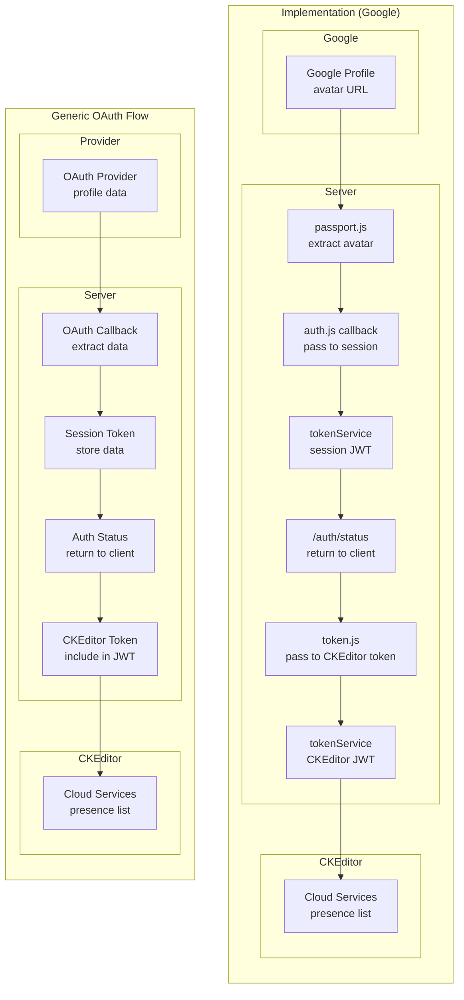
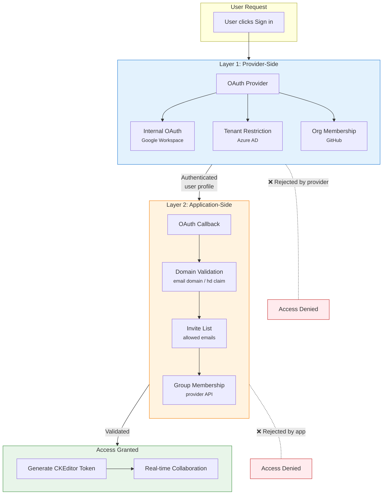

```mermaid
sequenceDiagram
    participant B as Browser
    participant S as Server
    participant P as OAuth Provider
    participant C as CKEditor Cloud

    B->>S: Click "Sign in"
    S->>P: Redirect to OAuth consent
    P->>B: User authenticates
    P->>S: Callback with auth code
    S->>P: Exchange code for token
    P->>S: Access token + profile
    S->>B: Session cookie + redirect
    B->>S: Request CKEditor token
    S->>B: JWT token
    B->>C: Connect with JWT
    C->>B: Real-time collaboration!
```

```mermaid
flowchart LR
    subgraph Generic["Generic OAuth Flow"]
        direction TB
        subgraph Provider
            GP[OAuth Provider<br/>profile data]
        end
        subgraph Server1[Server]
            GC[OAuth Callback<br/>extract data]
            GS[Session Token<br/>store data]
            GA[Auth Status<br/>return to client]
            GT[CKEditor Token<br/>include in JWT]
        end
        subgraph CKEditor1[CKEditor]
            GE[Cloud Services<br/>presence list]
        end
        GP --> GC --> GS --> GA --> GT --> GE
    end

    subgraph Concrete["Implementation (Google)"]
        direction TB
        subgraph Google
            IG[Google Profile<br/>avatar URL]
        end
        subgraph Server2[Server]
            IP[passport.js<br/>extract avatar]
            IA[auth.js callback<br/>pass to session]
            IT1[tokenService<br/>session JWT]
            IS["/auth/status<br/>return to client"]
            IT2[token.js<br/>pass to CKEditor token]
            IT3[tokenService<br/>CKEditor JWT]
        end
        subgraph CKEditor2[CKEditor]
            IC[Cloud Services<br/>presence list]
        end
        IG --> IP --> IA --> IT1 --> IS --> IT2 --> IT3 --> IC
    end

    Generic ~~~ Concrete
```

```mermaid
flowchart TB
      subgraph User["User Request"]
          U[User clicks Sign in]
      end

      subgraph Layer1["Layer 1: Provider-Side"]
          direction TB
          P[OAuth Provider]
          P1["Internal OAuth<br/><small>Google Workspace</small>"]
          P2["Tenant Restriction<br/><small>Azure AD</small>"]
          P3["Org Membership<br/><small>GitHub</small>"]
          P --> P1 & P2 & P3
      end

      subgraph Layer2["Layer 2: Application-Side"]
          direction TB
          A[OAuth Callback]
          A1["Domain Validation<br/><small>email domain / hd claim</small>"]
          A2["Invite List<br/><small>allowed emails</small>"]
          A3["Group Membership<br/><small>provider API</small>"]
          A --> A1
          A1 --> A2
          A2 --> A3
      end

      subgraph Access["Access Granted"]
          T[Generate CKEditor Token]
          C[Real-time Collaboration]
          T --> C
      end

      U --> Layer1
      Layer1 -->|"Authenticated<br/>user profile"| Layer2
      Layer2 -->|"Validated"| Access

      Layer1 -.-|"❌ Rejected by provider"| X1[Access Denied]
      Layer2 -.-|"❌ Rejected by app"| X2[Access Denied]

      style Layer1 fill:#e3f2fd,stroke:#1976d2
      style Layer2 fill:#fff3e0,stroke:#f57c00
      style Access fill:#e8f5e9,stroke:#388e3c
      style X1 fill:#ffebee,stroke:#c62828
      style X2 fill:#ffebee,stroke:#c62828
```

```mermaid
treemap-beta
"dist/vite.js (297.22 KiB)"
    "node_modules (297.14 KiB)"
        "@ckeditor (230.82 KiB)"
            "ckeditor-cloud-services-collaboration/node_modules/engine.io-client/node_modules/engine.io-parser/build/esm (29.94 KiB)"
                "commons.js": 29.94
            "ckeditor5-engine (72.26 KiB)"
                "src (72.06 KiB)"
                    "model (34.66 KiB)"
                        "operation (8.65 KiB)"
                            "transform.ts": 3.2
                            "utils.ts": 1.0
                            "moveoperation.ts": 0.7
                            "splitoperation.ts": 0.6
                            "mergeoperation.ts": 0.6
                            "attributeoperation.ts": 0.5
                            "insertoperation.ts": 0.5
                            "markeroperation.ts": 0.4
                            "renameoperation.ts": 0.4
                            "rootattributeoperation.ts": 0.3
                            "operation.ts": 0.25
                            "nooperation.ts": 0.2
                        "utils (5.06 KiB)"
                            "insertcontent.ts": 1.6
                            "deletecontent.ts": 1.2
                            "selection-post-fixer.ts": 1.0
                            "modifyselection.ts": 0.7
                            "getselectedcontent.ts": 0.4
                            "insertobject.ts": 0.16
                        "writer.ts": 3.6
                        "differ.ts": 3.0
                        "schema.ts": 2.7
                        "selection.ts": 1.7
                        "position.ts": 1.5
                        "range.ts": 1.4
                        "treewalker.ts": 1.3
                        "documentselection.ts": 1.1
                        "model.ts": 1.0
                        "document.ts": 0.8
                        "element.ts": 0.7
                        "markercollection.ts": 0.6
                        "history.ts": 0.5
                        "node.ts": 0.5
                        "liverange.ts": 0.4
                        "documentfragment.ts": 0.4
                        "batch.ts": 0.3
                        "nodelist.ts": 0.3
                        "liveposition.ts": 0.25
                        "text.ts": 0.2
                    "view (25.68 KiB)"
                        "observer"
                            "selectionobserver.ts": 0.7
                            "mutationobserver.ts": 0.5
                            "focusobserver.ts": 0.4
                            "observer.ts": 0.3
                            "keyobserver.ts": 0.2
                            "arrowkeysobserver.ts": 0.15
                            "inputobserver.ts": 0.15
                        "domconverter.ts": 4.2
                        "downcastwriter.ts": 3.6
                        "renderer.ts": 3.0
                        "element.ts": 1.5
                        "view.ts": 1.5
                        "stylesmap.ts": 1.4
                        "selection.ts": 1.2
                        "treewalker.ts": 1.0
                        "position.ts": 0.9
                        "range.ts": 0.8
                        "matcher.ts": 0.8
                        "placeholder.ts": 0.7
                        "document.ts": 0.6
                        "filler.ts": 0.6
                        "node.ts": 0.5
                        "editableelement.ts": 0.3
                        "containerelement.ts": 0.3
                        "attributeelement.ts": 0.3
                        "text.ts": 0.2
                    "conversion"
                        "downcasthelpers.ts": 3.0
                        "upcasthelpers.ts": 1.7
                        "downcastdispatcher.ts": 1.2
                        "mapper.ts": 1.0
                        "upcastdispatcher.ts": 0.9
                        "viewconsumable.ts": 0.6
                        "modelconsumable.ts": 0.3
                    "controller"
                        "datacontroller.ts": 1.8
                        "editingcontroller.ts": 1.2
            "ckeditor5-ui (34.50 KiB)"
                "src (32.29 KiB)"
                    "menubar"
                        "utils.ts": 1.6
                        "menubarview.ts": 0.8
                        "menubarmenuview.ts": 0.7
                        "menubarmenulistitembuttonview.ts": 0.5
                        "menubarmenupanelview.ts": 0.4
                    "dropdown"
                        "utils.ts": 1.4
                        "dropdownview.ts": 0.7
                        "button": 0.8
                        "menu": 0.5
                    "editorui"
                        "poweredby.ts": 1.4
                        "editorui.ts": 0.9
                        "evaluationbadge.ts": 0.4
                        "editoruiview.ts": 0.3
                    "toolbar"
                        "toolbarview.ts": 1.8
                        "balloon (balloontoolbar.ts)": 1.0
                        "block": 0.6
                    "dialog"
                        "dialogview.ts": 1.3
                        "dialog.ts": 0.7
                    "panel"
                        "balloon (balloonpanelview.ts)": 1.2
                        "sticky": 0.7
                    "search"
                        "text (searchtextview.ts)": 0.9
                        "autocomplete (autocompleteview.ts)": 0.7
                    "list"
                        "listview.ts": 0.8
                        "listitemview.ts": 0.4
                        "listitemgroupview.ts": 0.3
                    "button"
                        "buttonview.ts": 0.8
                        "switchbuttonview.ts": 0.3
                        "buttonlabelview.ts": 0.3
                    "bindings": 1.0
                    "labeledfield": 1.0
                    "editableui": 0.7
                    "input (inputbase.ts)": 0.6
                    "icon (iconview.ts)": 0.5
                    "label (labelview.ts)": 0.3
                    "template.ts": 2.2
                    "view.ts": 1.0
                    "focuscycler.ts": 0.8
                    "tooltipmanager.ts": 0.6
                    "arialiveannouncer.ts": 0.5
                    "viewcollection.ts": 0.5
                    "componentfactory.ts": 0.4
                "dist": 2.2
            "ckeditor5-revision-history/dist (22.34 KiB)"
                "index.js": 22.34
            "ckeditor5-utils (14.13 KiB)"
                "src (14.07 KiB)"
                    "dom"
                        "rect.ts": 1.2
                        "position.ts": 1.0
                        "scroll.ts": 0.8
                        "emittermixin.ts": 0.4
                        "resizeobserver.ts": 0.3
                        "createelement.ts": 0.2
                        "getancestors.ts": 0.1
                        "getdatafromelement.ts": 0.1
                        "indexof.ts": 0.1
                        "insertat.ts": 0.1
                        "iswindow.ts": 0.1
                        "isrange.ts": 0.1
                        "istext.ts": 0.05
                        "isnode.ts": 0.05
                        "tounit.ts": 0.05
                    "observablemixin.ts": 1.2
                    "emittermixin.ts": 1.0
                    "collection.ts": 0.9
                    "keyboard.ts": 0.8
                    "fastdiff.ts": 0.6
                    "diff.ts": 0.5
                    "unicode.ts": 0.5
                    "env.ts": 0.5
                    "config.ts": 0.5
                    "ckeditorerror.ts": 0.4
                    "translation-service.ts": 0.4
                    "focustracker.ts": 0.4
                    "keystrokehandler.ts": 0.3
                    "locale.ts": 0.3
                    "eventinfo.ts": 0.2
                    "uid.ts": 0.2
                    "version.ts": 0.2
                    "priorities.ts": 0.2
                    "splicearray.ts": 0.1
                    "comparearrays.ts": 0.1
                    "tomap.ts": 0.1
            "ckeditor5-clipboard (7.69 KiB)"
                "src (7.64 KiB)"
                    "dragdrop.ts": 2.2
                    "dragdroptarget.ts": 1.6
                    "clipboardmarkersutils.ts": 1.0
                    "clipboardpipeline.ts": 0.8
                    "dragdropblocktoolbar.ts": 0.5
                    "pasteplaintext.ts": 0.4
                    "lineview.ts": 0.3
                    "utils"
                        "clipboardobserver.ts": 0.6
                        "viewtoplaintext.ts": 0.3
            "ckeditor5-core"
                "src"
                    "editor"
                        "editor.ts": 1.8
                        "accessibility.ts": 1.2
                        "context.ts": 0.7
                    "utils"
                        "plugincollection.ts": 0.8
                        "dataapimixin.ts": 0.3
                        "attachtoform.ts": 0.3
                    "plugin.ts": 0.4
                    "command.ts": 0.4
                    "multicommand.ts": 0.2
                    "pendingactions.ts": 0.2
                    "contextplugin.ts": 0.2
                "dist (index.js)": 0.9
            "ckeditor5-widget"
                "widget.ts": 1.2
                "utils.ts": 1.0
                "widgettypearound (widgettypearound.ts)": 1.0
                "widgettoolbarrepository.ts": 0.6
                "verticalnavigation.ts": 0.4
                "highlightstack.ts": 0.3
            "ckeditor5-watchdog"
                "src"
                    "editorwatchdog.ts": 1.8
                    "contextwatchdog.ts": 1.0
                    "watchdog.ts": 0.9
                    "utils": 0.3
            "ckeditor5-typing"
                "src"
                    "input.ts": 0.8
                    "deleteobserver.ts": 0.7
                    "deletecommand.ts": 0.6
                    "inserttextcommand.ts": 0.5
                    "delete.ts": 0.5
                    "inserttextobserver.ts": 0.4
                    "utils"
                        "findattributerange.ts": 0.3
                        "getlasttextline.ts": 0.2
                        "injectunsafekeystrokeshandling.ts": 0.5
            "ckeditor5-editor-multi-root"
                "src"
                    "multirooteditor.ts": 1.8
                    "multirooteditorui.ts": 1.0
                    "multirooteditoruiview.ts": 0.7
            "ckeditor5-operations-compressor/dist"
                "index.js": 3.0
            "ckeditor5-real-time-collaboration/dist"
                "index.js": 2.8
            "ckeditor5-collaboration-core/dist"
                "index.js": 2.6
            "ckeditor5-editor-classic"
                "src"
                    "classiceditor.ts": 1.2
                    "classiceditorui.ts": 0.9
                    "classiceditoruiview.ts": 0.4
            "ckeditor5-editor-decoupled"
                "src"
                    "decouplededitor.ts": 1.0
                    "decouplededitorui.ts": 0.7
                    "decouplededitoruiview.ts": 0.3
                "dist": 0.5
            "ckeditor5-comments/dist"
                "index.js": 2.2
            "ckeditor5-editor-inline"
                "src"
                    "inlineeditor.ts": 0.9
                    "inlineeditorui.ts": 0.7
                    "inlineeditoruiview.ts": 0.4
            "ckeditor5-select-all"
                "src"
                    "selectallcommand.ts": 0.5
                    "selectallediting.ts": 0.3
                    "selectallui.ts": 0.3
                "dist": 0.5
            "ckeditor5-editor-balloon"
                "src"
                    "ballooneditor.ts": 0.8
                    "ballooneditorui.ts": 0.5
                    "ballooneditoruiview.ts": 0.2
            "ckeditor5-paragraph"
                "src"
                    "paragraph.ts": 0.8
                    "paragraphcommand.ts": 0.4
                    "insertparagraphcommand.ts": 0.2
            "ckeditor5-undo"
                "src"
                    "basecommand.ts": 0.5
                    "undoediting.ts": 0.3
                    "undocommand.ts": 0.3
                    "redocommand.ts": 0.2
            "ckeditor5-enter"
                "src"
                    "utils.ts": 0.5
                    "shiftentercommand.ts": 0.4
                    "enterobserver.ts": 0.3
            "ckeditor5-markdown-gfm"
                "src"
                    "gfmdataprocessor.ts": 0.5
                    "markdown2html.ts": 0.2
                    "html2markdown.ts": 0.2
        "luxon/src (19.77 KiB)"
            "impl"
                "locale.js": 2.2
                "tokenParser.js": 2.0
                "regexParser.js": 1.6
                "english.js": 1.2
                "formatter.js": 1.0
                "util.js": 1.0
                "digits.js": 0.3
                "diff.js": 0.2
            "datetime.js": 5.5
            "duration.js": 1.8
            "zones"
                "IANAZone.js": 0.8
                "fixedOffsetZone.js": 0.2
                "invalidZone.js": 0.1
                "systemZone.js": 0.1
            "interval.js": 1.0
            "info.js": 0.5
            "settings.js": 0.3
        "lodash-es": 19.72
        "marked/lib (8.80 KiB)"
            "marked.esm.js": 8.80
        "protobufjs"
            "src"
                "reader.js": 1.4
                "writer.js": 1.3
                "util"
                    "minimal.js": 1.2
                "rpc": 0.4
                "index-minimal.js": 0.7
        "turndown/lib"
            "turndown.browser.es.js": 4.2
        "@protobufjs"
            "float": 0.9
            "base64": 0.7
            "utf8": 0.6
            "eventemitter": 0.5
            "inquire": 0.3
            "aspromise": 0.3
            "pool": 0.3
        "color-convert"
            "conversions.js": 1.4
            "route.js": 0.3
            "index.js": 0.2
        "color-name"
            "index.js": 1.0
        "url-parse"
            "index.js": 1.0
        "querystringify"
            "index.js": 0.6
        "turndown-plugin-gfm/lib"
            "turndown-plugin-gfm.es.js": 0.7
```
