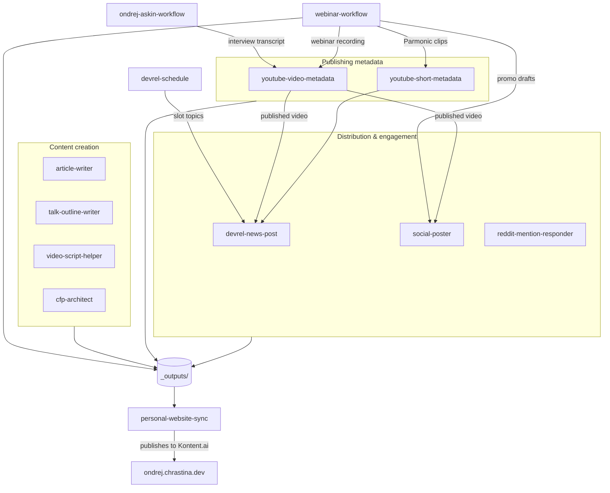
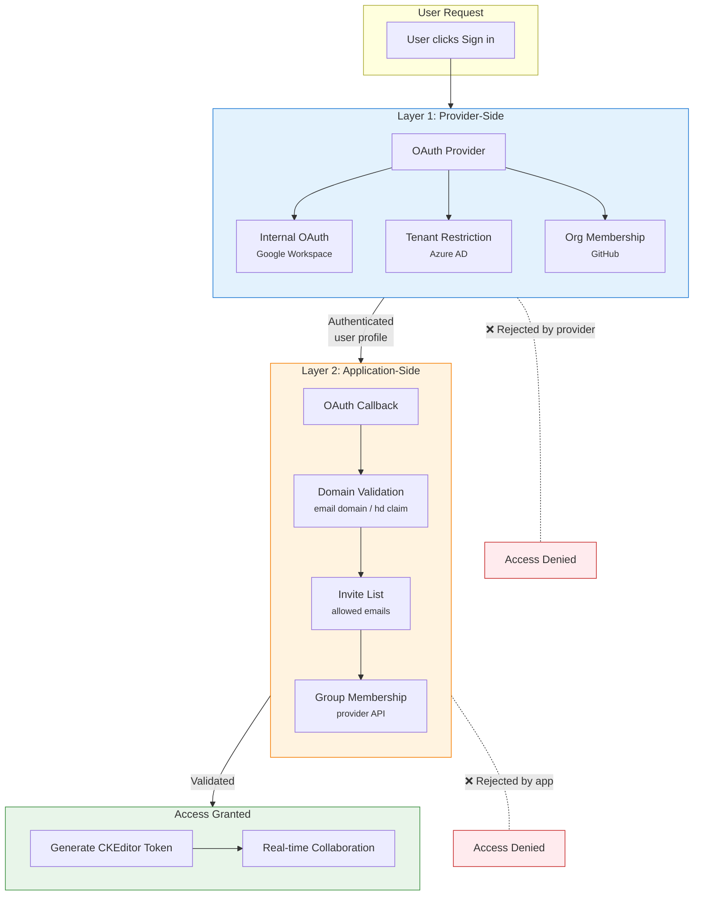

```mermaid
flowchart TD
    subgraph Content["Content creation"]
        AW[article-writer]
        TOW[talk-outline-writer]
        VSH[video-script-helper]
        CFP[cfp-architect]
    end

    subgraph Metadata["Publishing metadata"]
        YVM[youtube-video-metadata]
        YSM[youtube-short-metadata]
    end

    subgraph Distribution["Distribution & engagement"]
        DNP[devrel-news-post]
        SP[social-poster]
        RMR[reddit-mention-responder]
    end

    OAW[ondrej-askin-workflow] -->|"interview transcript"| YVM
    DS[devrel-schedule] -->|"slot topics"| DNP
    WW[webinar-workflow] -->|"webinar recording"| YVM
    WW -->|"Parmonic clips"| YSM
    WW -->|"promo drafts"| SP
    WW --> OUT
    YVM -->|"published video"| DNP
    YVM -->|"published video"| SP
    YSM --> DNP

    Content --> OUT[("_outputs/")]
    Metadata --> OUT
    Distribution --> OUT

    OUT --> PWS[personal-website-sync]
    PWS -->|"publishes to Kontent.ai"| SITE["ondrej.chrastina.dev"]
```

```mermaid
flowchart TB
      subgraph User["User Request"]
          U[User clicks Sign in]
      end

      subgraph Layer1["Layer 1: Provider-Side"]
          direction TB
          P[OAuth Provider]
          P1["Internal OAuth<br/><small>Google Workspace</small>"]
          P2["Tenant Restriction<br/><small>Azure AD</small>"]
          P3["Org Membership<br/><small>GitHub</small>"]
          P --> P1 & P2 & P3
      end

      subgraph Layer2["Layer 2: Application-Side"]
          direction TB
          A[OAuth Callback]
          A1["Domain Validation<br/><small>email domain / hd claim</small>"]
          A2["Invite List<br/><small>allowed emails</small>"]
          A3["Group Membership<br/><small>provider API</small>"]
          A --> A1
          A1 --> A2
          A2 --> A3
      end

      subgraph Access["Access Granted"]
          T[Generate CKEditor Token]
          C[Real-time Collaboration]
          T --> C
      end

      U --> Layer1
      Layer1 -->|"Authenticated<br/>user profile"| Layer2
      Layer2 -->|"Validated"| Access

      Layer1 -.-|"❌ Rejected by provider"| X1[Access Denied]
      Layer2 -.-|"❌ Rejected by app"| X2[Access Denied]

      style Layer1 fill:#e3f2fd,stroke:#1976d2
      style Layer2 fill:#fff3e0,stroke:#f57c00
      style Access fill:#e8f5e9,stroke:#388e3c
      style X1 fill:#ffebee,stroke:#c62828
      style X2 fill:#ffebee,stroke:#c62828

```
