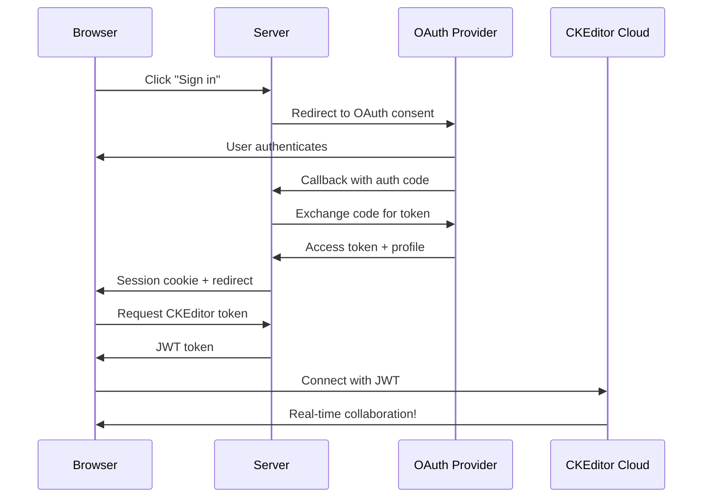
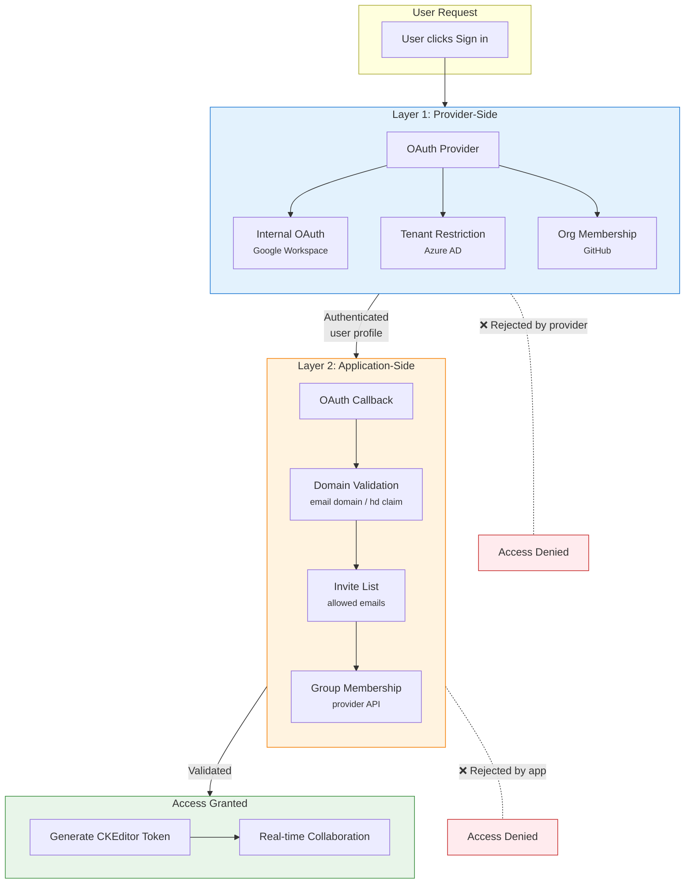

```mermaid
flowchart TD
    subgraph Generic["Generic OAuth Flow"]
        direction TB
        subgraph Provider
            GP[OAuth Provider<br/>profile data]
        end
        subgraph Server1[Server]
            GC[OAuth Callback<br/>extract data]
            GS[Session Token<br/>store data]
            GA[Auth Status<br/>return to client]
            GT[CKEditor Token<br/>include in JWT]
        end
        subgraph CKEditor1[CKEditor]
            GE[Cloud Services<br/>presence list]
        end
        GP --> GC --> GS --> GA --> GT --> GE
    end

    subgraph Concrete["Implementation (Google)"]
        direction TB
        subgraph Google
            IG[Google Profile<br/>avatar URL]
        end
        subgraph Server2[Server]
            IP[passport.js<br/>extract ava
            IA[auth.js callback<br/>pass to session]
            IT1[tokenService<br/>session J
            IS["/auth/status<br/>return to client"]
            IT2[token.js<br/>pass to CKEdi
            IT3[tokenService<br/>CKEditor JWT]
        end
        subgraph CKEditor2[CKEditor]
            IC[Cloud Services<br/>presence
        end
        IG --> IP --> IA --> IT1 --> IS --
    end

    GP -.-> IG
    GC -.-> IP
    GS -.-> IT1
    GA -.-> IS
    GT -.-> IT2
    GE -.-> IC
```


